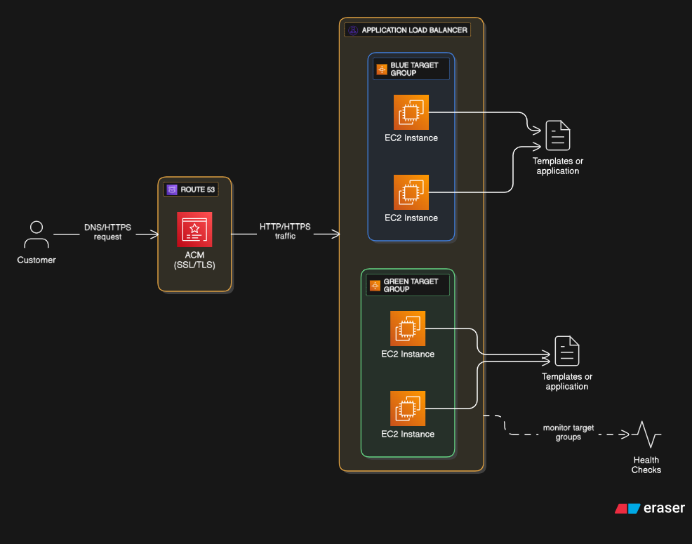

# 🌩️ AWS Blue–Green Deployment (Photography → Purplebuzz Website)

This project demonstrates a **Blue–Green Deployment model on AWS** to release a new version of a web application (Purplebuzz theme) from an existing version (Photography theme) with **zero downtime**.

---

## 🚀 Project Overview

- **Blue Environment (Current version):** Photography-themed static website  
- **Green Environment (New version):** Purplebuzz-themed upgraded design  
- **Goal:** Seamless switch to new version without any downtime using AWS services

---

## 🧱 AWS Architecture

### AWS Services Used

| Service | Purpose |
|----------|----------|
| **Amazon EC2** | Hosts Blue and Green environments (each serving different website versions) |
| **Application Load Balancer (ALB)** | Routes traffic between Blue & Green EC2 instances |
| **AWS Route 53** | DNS routing for domain management |
| **AWS Certificate Manager (ACM)** | Provides SSL/TLS certificates for HTTPS |
| **Amazon CloudWatch** | Monitors performance and health checks |
| **IAM** | Controls access and permissions |

---

## ⚙️ Blue–Green Deployment Flow

1. **Blue Environment**  
   - Hosted on EC2 instance 1  
   - Serves the Photography-themed website  
   - Target Group: `blue-tg`

2. **Green Environment**  
   - Hosted on EC2 instance 2  
   - Serves the new Purplebuzz version  
   - Target Group: `green-tg`

3. **Switch Over**  
   - ALB listener updated to forward traffic from `blue-tg` → `green-tg`  
   - **No downtime** — users see new version instantly

4. **Rollback Option**  
   - If an issue occurs, revert listener back to `blue-tg`

---

## 🧰 AWS Services Setup Summary

- **EC2:** Created two EC2 instances for Blue and Green
- **ALB:** Configured Application Load Balancer with two target groups
- **Route 53:** Added custom domain pointing to ALB
- **ACM:** Applied SSL certificate for HTTPS
- **CloudWatch:** Monitored instance and load balancer metrics

---

## 🧾 Detailed Steps
See [deployment_steps.md](./deployment_steps.md) for a full step-by-step implementation guide.

---

## 📸 Screenshots

| Component | Screenshot |
|------------|-------------|
| EC2 Instances |  |
| Application Load Balancer |  |
| Route 53 Setup |  |
| Blue–Green Switch |  |

---

## 🧩 Key Learnings

- Implemented **Blue–Green Deployment** on AWS  
- Achieved **zero downtime** deployment  
- Managed DNS & SSL using **Route 53 and ACM**  
- Configured **load balancing and health checks**  
- Hands-on with **real AWS services**

---

## 👩‍💻 Author
**Keerthi B**  
📧 Email: bkeerthi1528@gmail.com  
🔗 LinkedIn: [www.linkedin.com/in/siva-sai-keerthi-bondalapati-b89779248](#)
